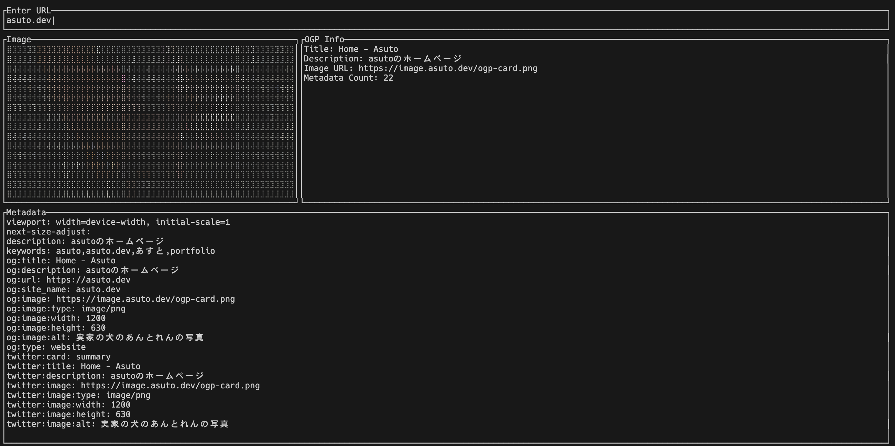

# OGP Checker

OGP Checker is a terminal-based application that fetches and displays Open Graph Protocol (OGP) metadata and images from a given URL. The application supports URLs with `localhost`, IP addresses, and ports. It provides a simple TUI (Text User Interface) for entering a URL, fetching metadata, and rendering the OGP image in the terminal.



## Features

- **URL Normalization**: Automatically adds `http://` or `https://` if not specified.
- **OGP Metadata Display**: Shows title, description, image URL, and metadata count.
- **Image Rendering**: Displays the OGP image in the terminal using `ratatui`.
- **Error Handling**: Provides user-friendly error messages for invalid URLs or failed requests.

## Requirements

- Rust (latest stable version)
- Terminal emulator supporting ANSI escape codes

## Installation

1. Clone the repository:
   ```
   git clone https://github.com/your-repo/ogp-checker.git
   cd ogp-checker
   ```

2. Install the application:
   ```
   cargo install --path .
   ```

3. Run the application:
   ```
   ogp-checker
   ```

## Usage

1. Launch the application.
2. Enter a URL in the "Enter URL" input box.
3. Press `Enter` to fetch the OGP metadata.
4. View the metadata and image displayed in the terminal.
5. Press `Esc` to exit the application.

### Supported URL Formats

- Fully qualified URLs:
  - `https://example.com`
  - `http://localhost`
  - `http://127.0.0.1:8080`

- Partial URLs:
  - `example.com` (will be normalized to `http://example.com`)

## Keyboard Shortcuts

- **Enter**: Fetch OGP metadata and image for the entered URL.
- **Backspace**: Delete the last character in the URL input.
- **Esc**: Exit the application.

## Dependencies

- [`tokio`](https://crates.io/crates/tokio): Asynchronous runtime.
- [`reqwest`](https://crates.io/crates/reqwest): HTTP client for fetching data.
- [`scraper`](https://crates.io/crates/scraper): HTML parsing library.
- [`image`](https://crates.io/crates/image): Image processing.
- [`crossterm`](https://crates.io/crates/crossterm): Terminal input and output.
- [`ratatui`](https://crates.io/crates/ratatui): Text user interface framework.

## File Structure

```
src/
├── image.rs        # Handles image loading and processing
├── lib.rs          # Library module declarations
├── main.rs         # Entry point for the application
├── ogp.rs          # OGP metadata fetching and TUI rendering logic
```

## Development

To contribute or modify the application:

1. Install the necessary dependencies:
   ```
   cargo build
   ```

2. Run the application in debug mode:
   ```
   cargo run
   ```

## Limitations

- Terminal image rendering depends on the terminal emulator's capabilities.
- Large images may render slowly or be truncated.
- Only supports OGP metadata retrieval; no additional protocols are supported.

## License

This project is licensed under the MIT License. See the `LICENSE` file for details.
